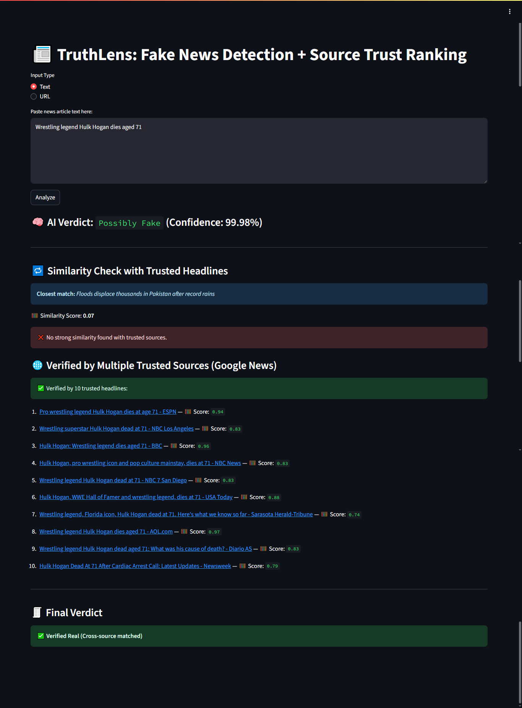
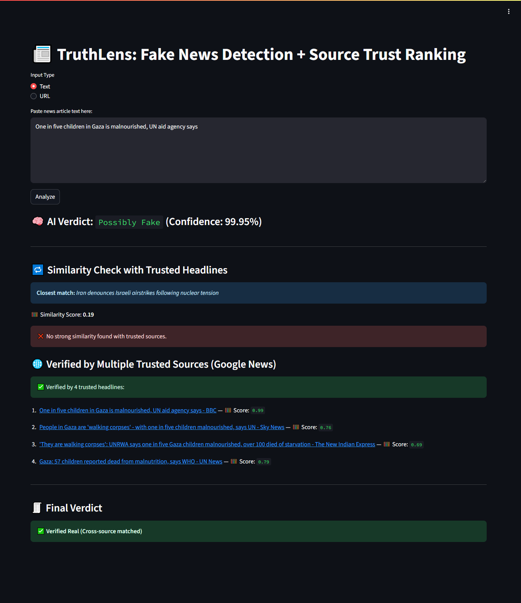
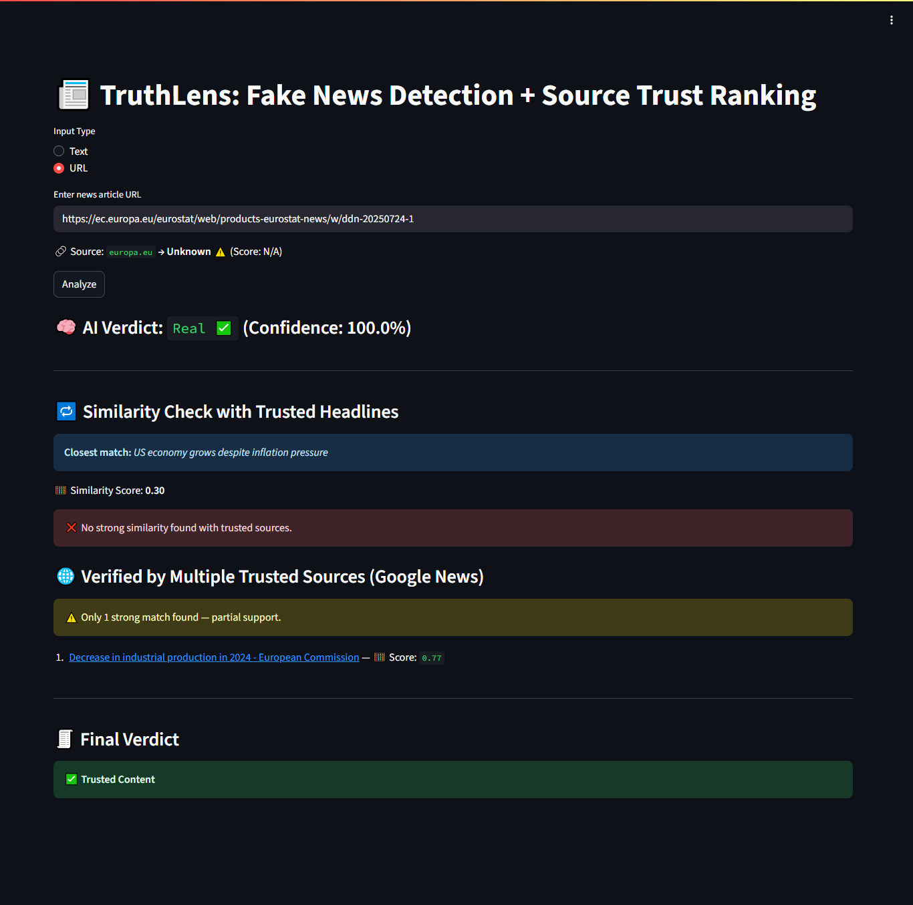
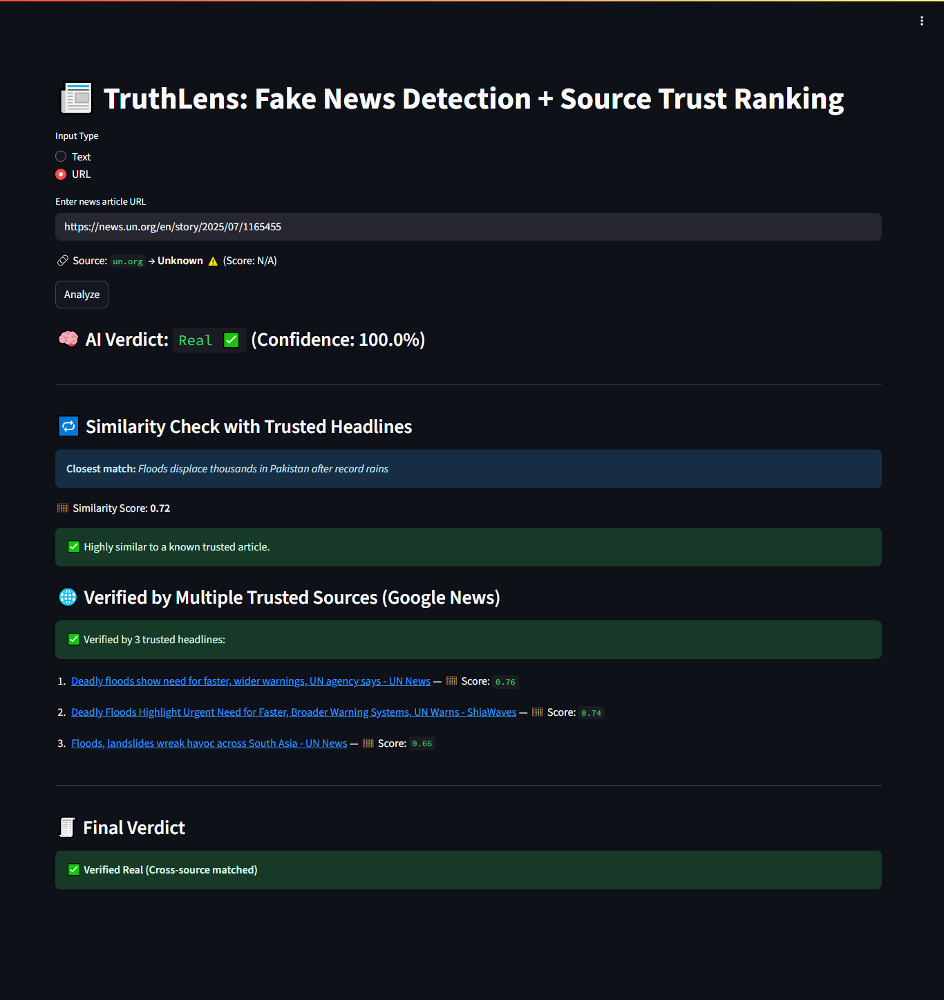

# 📰 TruthLens – AI-Powered Fake News Detector + Verifier

TruthLens is a real-time fake news detection and **truth verification system** built using state-of-the-art NLP models like **DistilBERT** and **SBERT**, combined with **real-time cross-checking from Google News**.

> ✨ Goal: Help users detect misinformation, understand source credibility, and verify facts using multiple trusted headlines.

---

## 🔍 Features

- 🤖 **Fake News Classifier** – Uses DistilBERT for binary classification (real vs fake)
- 🧠 **Semantic Similarity Ranking** – Compares your input with known trusted headlines using SBERT
- 🌐 **Google News RSS Verification** – Checks if the news is reported by multiple live trusted sources
- 📊 **Confidence Scores** – Clear verdicts with interpretable scores and override logic
- 🧾 **Final Verdict** – Smart rule-based logic prioritizes facts over language alone

---

## 🧠 Technologies Used

| Tool | Purpose |
|------|---------|
| `transformers` | Fake news classification (DistilBERT) |
| `sentence-transformers` | Semantic comparison (SBERT) |
| `Streamlit` | Frontend app interface |
| `feedparser` + `Google News RSS` | Real-time news search |
| `newspaper3k` | Extract full text from article URLs |
| `PyTorch` | Model inference |
| `tldextract` | Extract domain for source rating |

---

## 🚀 Demo Screenshot






---

## ⚙️ How to Run

```bash
# 1. Install dependencies
pip install -r requirements.txt

# 2. Run the app
streamlit run app.py
or
!pip install pyngrok
ngrok config add-authtoken YOUR_TOKEN_HERE
ngrok http 8501
